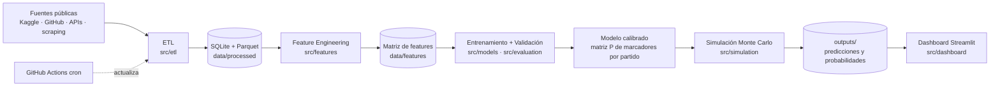
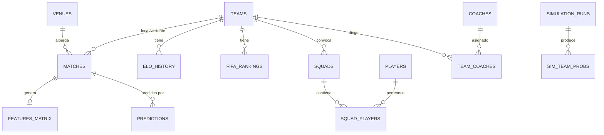

# Documento Técnico — Sistema de Predicción del Mundial FIFA 2026 con Machine Learning

**Proyecto personal y educativo · Presupuesto cero · Python**
**Versión 1.0 — 10 de junio de 2026**

---

## Índice

1. [Resumen ejecutivo y plan de ejecución](#1-resumen-ejecutivo-y-plan-de-ejecución)
2. [Arquitectura](#2-arquitectura)
3. [Fuentes de datos públicas recomendadas](#3-fuentes-de-datos-públicas-recomendadas)
4. [Diseño de base de datos](#4-diseño-de-base-de-datos)
5. [Pipeline de Machine Learning](#5-pipeline-de-machine-learning)
6. [Estrategia de simulación del torneo](#6-estrategia-de-simulación-del-torneo)
7. [Estrategia de validación histórica](#7-estrategia-de-validación-histórica)
8. [Roadmap por fases](#8-roadmap-por-fases)
9. [Riesgos técnicos](#9-riesgos-técnicos)
10. [Recomendaciones para mejorar el modelo](#10-recomendaciones-para-mejorar-el-modelo)

---

## 1. Resumen ejecutivo y plan de ejecución

### 1.1 Objetivo

Construir un sistema completo de ciencia de datos que, usando exclusivamente fuentes gratuitas y públicas, sea capaz de:

| # | Predicción | Cómo se obtiene |
|---|------------|-----------------|
| 1 | Marcador exacto de cada partido (ej. Argentina 2 – 1 España) | Matriz de probabilidades de marcadores del modelo híbrido (§5.5) |
| 2 | Resultados de la fase de grupos | Simulación partido a partido + tablas de posiciones (§6) |
| 3 | Clasificación a rondas eliminatorias | Reglas FIFA de desempate aplicadas sobre cada simulación (§6.3) |
| 4 | Probabilidad de avanzar en cada fase | Frecuencia relativa en N simulaciones Monte Carlo (§6.5) |
| 5 | Probabilidad de ser campeón | Frecuencia de campeonatos en N simulaciones |
| 6 | Campeón más probable | argmax de la distribución anterior |

### 1.2 Advertencia de calendario (crítica)

**El Mundial 2026 inicia el 11 de junio de 2026 — un día después de la fecha de este documento — y la final es el 19 de julio de 2026.** Esto no invalida el proyecto, pero obliga a adaptar la estrategia de evaluación:

- **Pre-registro por rondas:** el torneo dura 39 días. Un baseline rápido (Elo + Poisson, construible en 2–3 días) permite pre-registrar predicciones antes de que termine la fase de grupos (27 de junio) y, sobre todo, antes de cada ronda eliminatoria (dieciseisavos inician el 28 de junio). Cada predicción se guarda con timestamp en la tabla `predictions` **antes** de que se jueguen los partidos, lo que garantiza una evaluación honesta.
- **Evaluación retrospectiva válida:** el valor educativo principal (backtesting contra 2010–2022, §7) no depende del calendario. Si el sistema completo se termina después del torneo, se evalúa "como si" se hubiera predicho, con la disciplina de entrenar solo con datos anteriores al 11 de junio de 2026 (corte temporal estricto).
- El roadmap (§8) define dos pistas: **Pista Rápida** (baseline en días) y **Pista Completa** (sistema profesional en semanas).

### 1.3 Expectativas honestas (qué es alcanzable)

Para mantener el proyecto con rigor científico, conviene fijar expectativas basadas en la literatura y en el desempeño histórico de modelos públicos (FiveThirtyEight, Elo, casas de análisis):

| Métrica | Azar / ingenuo | Modelo bueno | Techo realista |
|---|---|---|---|
| Acierto 1X2 (gana/empata/pierde) | ~33–40 % | 50–55 % | ~60 % |
| Acierto de marcador exacto | ~5–7 % | 9–12 % | ~15 % |
| Campeón en top-3 de probabilidades | — | frecuente | no garantizado |

El fútbol es un deporte de bajo marcador con enorme varianza: **el objetivo correcto no es "acertar siempre" sino producir probabilidades bien calibradas** (si el modelo dice 70 %, ese evento debe ocurrir ~70 % de las veces). Las métricas de §5.7 y §7 miden exactamente eso.

### 1.4 Principios de ejecución

1. **Presupuesto cero:** solo APIs gratuitas, datasets de Kaggle/GitHub, datos abiertos y scraping educativo respetuoso (rate-limiting, caché local, cumplimiento de `robots.txt`).
2. **Reproducibilidad:** todo dato crudo se versiona localmente; toda corrida de entrenamiento y simulación registra semilla, configuración y hash de datos.
3. **Anti-fuga temporal (no leakage):** ninguna feature de un partido puede usar información posterior a su fecha. Es la regla #1 del proyecto (§9, riesgo R3).
4. **Gates entre fases:** ninguna fase del roadmap inicia sin que la anterior cumpla sus criterios de aceptación (§8).

---

## 2. Arquitectura

### 2.1 Stack tecnológico (todo gratuito)

| Capa | Herramienta | Uso |
|---|---|---|
| Lenguaje | Python 3.11+ | Todo el sistema |
| Datos | Pandas, NumPy, PyArrow | ETL, features, Parquet |
| Almacenamiento | SQLite + Parquet | Base relacional + columnar analítico |
| Estadística | SciPy, Statsmodels | Poisson, Dixon-Coles, tests |
| ML | Scikit-Learn, XGBoost, LightGBM, (CatBoost opcional) | Modelos y calibración |
| Simulación | NumPy (vectorizado) | Monte Carlo 100k–1M corridas |
| Visualización | Plotly | Gráficas interactivas |
| Dashboard | Streamlit | App local / Streamlit Community Cloud (gratis) |
| Orquestación | Scripts CLI + Makefile/`invoke`; GitHub Actions (cron gratuito) | Actualización automática de datos |
| Tracking | MLflow local (opcional, gratis) | Experimentos y métricas |
| Control de versiones | Git + GitHub (repo público gratis) | Código y configs |

### 2.2 Estructura de carpetas

```
mundial-2026-ml/
├── README.md
├── pyproject.toml              # dependencias (uv/pip)
├── Makefile                    # comandos: etl, features, train, simulate, dashboard
├── configs/
│   ├── data_sources.yaml       # URLs, rutas, versiones de datasets
│   ├── features.yaml           # ventanas (5/10/20), flags de features
│   ├── models.yaml             # hiperparámetros por modelo
│   └── tournament_2026.yaml    # grupos, calendario, sedes, reglas de desempate
├── data/
│   ├── raw/                    # descargas intactas (CSV/JSON, con fecha de descarga)
│   ├── external/               # datasets manuales (Kaggle, StatsBomb)
│   ├── processed/              # tablas limpias y normalizadas (Parquet + SQLite)
│   └── features/               # matriz de features lista para entrenar (Parquet)
├── db/
│   └── worldcup.sqlite
├── notebooks/                  # EDA y experimentos (numerados: 01_eda.ipynb, ...)
├── src/
│   ├── etl/                    # descarga, limpieza, normalización de nombres de países
│   │   ├── download.py
│   │   ├── clean.py
│   │   └── load.py
│   ├── features/               # ingeniería de características
│   │   ├── form.py             # forma reciente 5/10/20
│   │   ├── elo.py              # cálculo/ingesta de Elo
│   │   ├── squad.py            # plantel, valor, edad
│   │   └── context.py          # viaje, altitud, clima, descanso
│   ├── models/
│   │   ├── poisson.py          # Poisson independiente (baseline)
│   │   ├── dixon_coles.py      # Dixon-Coles con decaimiento temporal
│   │   ├── gbm_goals.py        # XGBoost/LightGBM → tasas de gol λ
│   │   ├── classifiers.py      # LogReg/RF/CatBoost 1X2 (comparación)
│   │   ├── calibration.py      # Platt / isotónica
│   │   └── ensemble.py         # mezcla de modelos
│   ├── simulation/
│   │   ├── match.py            # muestreo de marcadores desde la matriz de prob.
│   │   ├── group_stage.py      # tablas + desempates FIFA
│   │   ├── knockout.py         # bracket, prórroga, penales
│   │   └── monte_carlo.py      # motor vectorizado N simulaciones
│   ├── evaluation/
│   │   ├── metrics.py          # log-loss, Brier, RPS, acierto exacto
│   │   ├── backtest.py         # validación 2010/2014/2018/2022
│   │   └── calibration_plots.py
│   └── dashboard/
│       └── app.py              # Streamlit
├── tests/                      # pytest: desempates FIFA, anti-leakage, métricas
├── outputs/
│   ├── predictions/            # predicciones pre-registradas (con timestamp)
│   ├── simulations/            # resultados agregados por corrida
│   └── reports/                # informes de validación
└── .github/workflows/
    └── update_data.yml         # cron diario: refrescar resultados y Elo
```

### 2.3 Flujo de datos (pipeline)



### 2.4 Automatización de actualización de datos

- **GitHub Actions** con `schedule: cron` (gratis en repos públicos) ejecuta diariamente `make etl`: descarga el CSV de resultados de Kaggle/GitHub, re-scrapea Elo y rankings, y commitea los Parquet actualizados (o los publica como artefactos).
- Alternativa 100 % local: **Programador de tareas de Windows** ejecutando `python -m src.etl.download` cada noche.
- Cada descarga guarda copia cruda con fecha (`data/raw/results_2026-06-10.csv`) para auditoría y reproducibilidad.

---

## 3. Fuentes de datos públicas recomendadas

Regla del proyecto: **cada categoría tiene fuente principal y plan B**, porque las fuentes gratuitas pueden romperse (§9, riesgo R2).

### 3.1 Historial de partidos internacionales (2000–presente; de hecho desde 1872)

| | Detalle |
|---|---|
| **Fuente principal** | Kaggle: **`martj42/international-football-results-from-1872-to-2017`** (se actualiza continuamente pese al nombre). Tres CSV: `results.csv` (fecha, equipos, goles, torneo, ciudad, país, bandera `neutral`), `shootouts.csv` (penales y ganador), `goalscorers.csv`. Cobertura: ~48 000 partidos de selecciones absolutas. Licencia abierta. |
| **Plan B** | GitHub **`openfootball`** (datos en texto plano de mundiales y torneos); Wikipedia (scraping de páginas de torneos). |
| **Cubre los campos pedidos** | fecha ✔, competición ✔, local/visitante ✔, goles ✔, penales ✔ (`shootouts.csv`), sede/ciudad ✔, país anfitrión ✔ (columna `country` + `neutral`). |

### 3.2 Rankings y ratings

| | Detalle |
|---|---|
| **Elo histórico** | **eloratings.net** (World Football Elo Ratings): histórico completo por selección desde el siglo XIX. Scraping educativo con caché, o espejos en Kaggle. **Alternativa robusta y recomendada: calcular Elo propio** desde `results.csv` (fórmula pública; ~50 líneas de código en `src/features/elo.py`). Ventaja: control total, cero dependencia externa, permite variantes (K por importancia de torneo). |
| **Ranking FIFA histórico** | Kaggle: datasets tipo *"FIFA World Ranking 1992–presente"* (varios espejos mantenidos); plan B: scraping de `inside.fifa.com/fifa-world-ranking`. Nota: la fórmula FIFA cambió en 2018 (ahora es un Elo modificado), tenerlo en cuenta como feature. |
| **Diferencia/evolución de Elo** | Derivadas en feature engineering: `elo_diff`, `elo_change_90d`, `elo_change_365d`. |

### 3.3 Rendimiento reciente

No requiere fuente adicional: **se calcula desde el historial de partidos** (§3.1) en `src/features/form.py` con ventanas móviles de 5/10/20 partidos por selección, siempre con corte a la fecha del partido (anti-leakage): victorias, empates, derrotas, GF, GC, diferencia, puntos (3-1-0).

### 3.4 Datos avanzados (xG, tiros, posesión)

**Limitación real:** no existe cobertura xG global, gratuita e histórica para selecciones. Estrategia en tres niveles:

| Nivel | Fuente | Cobertura |
|---|---|---|
| 1. Eventos completos con xG | **StatsBomb Open Data** (GitHub `statsbomb/open-data`, gratis): Mundial 2018 y 2022 completos, Eurocopas, mundiales femeninos. | Excelente pero solo torneos seleccionados. |
| 2. Estadísticas agregadas | **FBref** (vía librería Python `soccerdata`): xG, tiros, tiros al arco, posesión y precisión de pase para Mundial 2018+, Euro, Copa América. | Torneos mayores desde ~2018. |
| 3. Ratings ofensivo/defensivo | Archivo histórico de **FiveThirtyEight SPI** (GitHub `fivethirtyeight/data`, descontinuado en 2023 pero descargable): ratings off/def por selección. | Hasta 2023. |
| 4. **Proxy propio (plan B global)** | "xG sintético": goles esperados estimados desde Elo ofensivo/defensivo propio + promedios móviles de goles ajustados por rival. | Cobertura total 2000–2026. |

**Decisión de diseño:** las features avanzadas (xG real) entran como *features opcionales* activables en `configs/features.yaml`; el modelo principal debe funcionar sin ellas para no sesgar el backtesting de 2010/2014 (donde no existen).

### 3.5 Datos de jugadores

| Dato | Fuente principal | Plan B |
|---|---|---|
| Planteles por mundial | Kaggle (*FIFA World Cup Squads*, varios datasets por edición) | Wikipedia (tablas de convocados, scraping sencillo) |
| Valor de mercado (total, promedio) | **Transfermarkt** vía scraping educativo o el proyecto GitHub **`transfermarkt-datasets`** (dumps abiertos) | Kaggle (espejos de valores Transfermarkt por año) |
| Edad promedio, jugadores en ligas top, experiencia internacional (caps) | Derivado de planteles + club de cada jugador (Transfermarkt/Wikipedia) | — |
| Minutos de temporada, lesiones, suspensiones | **Cobertura gratuita pobre y no histórica.** Se reduce a flags manuales para 2026 (lesiones públicas de figuras clave, fuente: prensa/Wikipedia) | Omitir en backtesting |

> Nota ética/legal: scraping de Transfermarkt solo para uso personal-educativo, con rate-limit (≥3 s entre requests), caché en disco y sin republicar datos crudos.

### 3.6 Datos de entrenadores

Fuente: **Wikipedia** (página de cada selección y de cada mundial lista al DT, fecha de inicio y trayectoria). Features: antigüedad en el cargo (días), % de victorias en el ciclo, mundiales previos dirigidos, partidos internacionales dirigidos. Es un dataset pequeño (~50 entrenadores por mundial): viable construirlo semi-manualmente en CSV versionado (`data/external/coaches.csv`).

### 3.7 Factores contextuales

| Factor | Cómo obtenerlo gratis |
|---|---|
| País anfitrión / ventaja local | Columnas `country` + `neutral` del dataset de partidos; para 2026: EE. UU., México, Canadá (config) |
| Distancia de viaje | Coordenadas de sedes (config) + fórmula de Haversine entre partidos consecutivos de cada equipo |
| Altitud | API gratuita **Open-Meteo Elevation** u **Open-Elevation**; las 16 sedes 2026 se fijan en `tournament_2026.yaml` (ej. Ciudad de México ~2 240 m, Guadalajara ~1 560 m) |
| Clima | **Open-Meteo** (API gratis, histórico y pronóstico): temperatura y humedad por sede/fecha |
| Descanso entre partidos | Derivado del calendario (días desde el último partido del equipo) |
| Ventaja geográfica / confederación | Feature categórica: continente del torneo vs. confederación del equipo |

---

## 4. Diseño de base de datos

SQLite como base relacional única (`db/worldcup.sqlite`) + espejos Parquet de las tablas grandes para análisis rápido con Pandas.

### 4.1 Diagrama entidad-relación



### 4.2 Tablas principales

| Tabla | Campos clave | Notas |
|---|---|---|
| `teams` | `team_id`, `name`, `fifa_code`, `confederation`, `aliases` (JSON) | `aliases` resuelve el problema #1 de ETL: nombres inconsistentes entre fuentes ("USA" vs "United States", "Côte d'Ivoire" vs "Ivory Coast") |
| `matches` | `match_id`, `date`, `tournament`, `home_team_id`, `away_team_id`, `home_goals`, `away_goals`, `neutral`, `venue_id`, `host_country`, `shootout_winner_id` | Grano: 1 fila por partido oficial de selecciones desde 2000 (cargar desde 1990 para que el Elo propio converja antes del 2000) |
| `elo_history` | `team_id`, `date`, `elo`, `source` (`own`/`eloratings`) | Snapshot tras cada partido |
| `fifa_rankings` | `team_id`, `ranking_date`, `rank`, `points` | Mensual desde 1992 |
| `venues` | `venue_id`, `name`, `city`, `country`, `lat`, `lon`, `altitude_m`, `capacity` | Las 16 sedes 2026 + sedes históricas de mundiales |
| `squads` / `squad_players` / `players` | plantel por torneo: edad, club, liga, valor de mercado, caps | Valores de mercado con `valuation_date` para evitar leakage |
| `coaches` / `team_coaches` | DT, fecha inicio/fin, mundiales previos | CSV semi-manual |
| `features_matrix` | `match_id` + ~60–80 columnas de features + targets (`home_goals`, `away_goals`, `outcome`) | Materializada en Parquet; es la entrada del entrenamiento |
| `predictions` | `prediction_id`, `match_id`, `model_version`, `created_at`, `p_home_win`, `p_draw`, `p_away_win`, `score_matrix` (JSON 11×11), `predicted_score` | `created_at` es el **pre-registro**: prueba de que la predicción fue anterior al partido |
| `simulation_runs` / `sim_team_probs` | corrida: `run_id`, `n_sims`, `seed`, `model_version`, `created_at`; por equipo: `p_group_qualify`, `p_r32`, `p_r16`, `p_qf`, `p_sf`, `p_final`, `p_champion` | Una fila por equipo por corrida |

---

## 5. Pipeline de Machine Learning

### 5.1 Variable objetivo: ¿qué se modela?

Para predecir marcadores exactos hay dos caminos:

- **(a) Clasificación directa del marcador** (clases "2-1", "1-0", …): mala idea — cientos de clases raras, sin estructura.
- **(b) Modelar tasas de gol (λ_local, λ_visitante) y derivar la distribución conjunta de marcadores.** ✔ **Elegida.** Un solo modelo produce TODO lo pedido: P(marcador exacto), P(victoria/empate/derrota) (sumando regiones de la matriz), y entradas para la simulación.

### 5.2 Ingeniería de características

Todas calculadas **con corte estricto a la fecha del partido** (solo información disponible antes del pitazo inicial):

| Grupo | Features (por equipo y como diferencia local–visitante) |
|---|---|
| **Rating** | Elo, diferencia de Elo, momentum de Elo (Δ 90/365 días), ranking FIFA, puntos FIFA |
| **Forma 5/10/20** | V/E/D, GF, GC, diferencia de gol, puntos, % victorias, racha actual |
| **Ataque/defensa ajustados** | Goles a favor/en contra ponderados por Elo del rival y con decaimiento temporal exponencial |
| **Plantel** | Valor de mercado total y promedio (log), edad promedio, nº jugadores en ligas top-5, caps promedio |
| **Entrenador** | Antigüedad (días), % victorias del ciclo, mundiales previos |
| **Contexto** | Local/neutral/visitante, anfitrión del torneo, distancia viajada desde el partido anterior (km), altitud de la sede, días de descanso, misma confederación que el anfitrión |
| **Torneo** | Importancia del partido (amistoso < eliminatoria < copa continental < mundial), fase (grupos/eliminatoria) |
| **Avanzadas (opcionales)** | xG/xGA promedios (FBref/StatsBomb donde exista), rating off/def SPI |

### 5.3 Comparación de modelos

#### Modelos estadísticos

| Modelo | Ventajas | Desventajas |
|---|---|---|
| **Poisson independiente** (GLM, Statsmodels) | Simple, interpretable, da matriz de marcadores directamente, baseline obligatorio | Asume independencia entre goles de ambos equipos; subestima 0-0 y 1-1; no usa muchas features |
| **Dixon-Coles** | Corrige la dependencia en marcadores bajos (factor τ); incorpora decaimiento temporal ξ (partidos recientes pesan más); estándar de la industria | Ajuste por máxima verosimilitud propio (no viene en librería); parámetros por equipo requieren suficientes partidos |
| **Poisson bivariado** | Modela correlación explícita entre goles de ambos equipos (covarianza λ₃); mejor ajuste teórico del empate | Más complejo de estimar; ganancia práctica modesta sobre Dixon-Coles; riesgo de sobreajuste con pocos datos de selecciones |

#### Machine Learning tradicional

| Modelo | Ventajas | Desventajas |
|---|---|---|
| **Regresión Logística** (multinomial 1X2) | Rápida, interpretable, difícil de sobreajustar, excelente baseline ML y buen calibrador | Solo 1X2 (no marcador); relaciones lineales |
| **Random Forest** | No lineal, robusto a outliers, poca afinación | Probabilidades mal calibradas de fábrica; peor que boosting en tabulares; modelos pesados |
| **XGBoost** | Estado del arte en datos tabulares; **soporta objetivo `count:poisson`** → predice λ directamente; regularización fuerte; maneja interacciones | Requiere afinación de hiperparámetros; riesgo de leakage si las features están mal construidas |
| **LightGBM** | Igual de potente que XGBoost y más rápido; también con objetivo Poisson; ideal para iterar | Sensible a hiperparámetros en datasets pequeños (overfitting con hojas grandes) |

#### Modelos avanzados

| Modelo | Ventajas | Desventajas |
|---|---|---|
| **CatBoost** | Manejo nativo de categóricas (confederación, torneo); buena calibración de fábrica; poca afinación | Más lento de entrenar; ganancia marginal vs XGB/LGBM aquí |
| **Redes neuronales** (MLP) | Flexibilidad total; permite embeddings de equipos | El dataset es pequeño (~25–30 k partidos útiles, ~64 de mundial por edición): las redes rinden igual o peor que boosting en tabulares pequeños; más difíciles de calibrar e interpretar. **No recomendadas como modelo principal**; sí como ejercicio educativo en fase tardía |

### 5.4 Recomendación: arquitectura híbrida en dos etapas

> **GBM-Poisson + capa Dixon-Coles** — combina la capacidad de los gradient boosting para explotar todas las features con la estructura estadística correcta para marcadores de fútbol.

1. **Etapa 1 — tasas de gol:** dos modelos LightGBM/XGBoost con objetivo Poisson predicen `λ_home` y `λ_away` por partido usando todas las features de §5.2. (Implementación simétrica: una fila por equipo-partido con features propias y del rival.)
2. **Etapa 2 — matriz de marcadores:** con (λ_home, λ_away) se construye la matriz 11×11 de P(i goles, j goles) vía Poisson, y se aplica la **corrección Dixon-Coles τ(i,j,ρ)** a los marcadores 0-0, 1-0, 0-1, 1-1. El parámetro ρ se ajusta por máxima verosimilitud en validación.
3. **Salidas por partido:**
   - **Marcador más probable:** argmax de la matriz → "Argentina 2 – 1 España (7.4 %)".
   - **P(victoria) = Σ matriz triángulo inferior; P(empate) = Σ diagonal; P(derrota) = Σ triángulo superior.**
   - La matriz completa alimenta la simulación Monte Carlo (§6).
4. **Modelos de comparación (siempre se entrenan):** Poisson GLM, Dixon-Coles clásico, LogReg 1X2, RF, CatBoost. La tabla comparativa de métricas es un entregable del proyecto.
5. **Ensamble (fase final):** promedio ponderado de las matrices de probabilidad de los 2–3 mejores modelos, pesos optimizados por log-loss en validación.

### 5.5 Calibración

- Para 1X2: regresión isotónica o Platt sobre las probabilidades fuera-de-muestra (validación temporal), por clase.
- Verificación con **diagramas de confiabilidad** (calibration plots) y ECE (expected calibration error).
- La calibración se ajusta SOLO con datos de validación, nunca de test.

### 5.6 Esquema de validación (anti-leakage)

- **Split temporal estricto**, jamás aleatorio: entrenar con partidos < fecha de corte, validar con los siguientes.
- **Validación cruzada de origen rodante (rolling-origin):** múltiples cortes (2014, 2016, 2018, 2020, 2022, 2024) para afinar hiperparámetros.
- **Tests automáticos anti-leakage** en `tests/`: verificar que ninguna feature de un partido cambia si se eliminan del dataset los partidos posteriores.

### 5.7 Métricas

| Métrica | Qué mide | Uso |
|---|---|---|
| **Log-loss multiclase (1X2)** | Calidad probabilística global | Métrica principal de selección de modelos |
| **Brier score** | Error cuadrático de probabilidades | Complemento interpretable |
| **RPS (Ranked Probability Score)** | Como Brier pero respeta el orden V>E>D — estándar en predicción de fútbol | Métrica principal de reporte |
| **Accuracy 1X2** | % de aciertos del resultado | Comunicación (no para seleccionar modelos) |
| **Acierto de marcador exacto** | % donde el argmax de la matriz fue el marcador real | Comunicación; esperar 9–12 % |
| **Log-loss del marcador** | Probabilidad asignada al marcador real | Evalúa la matriz completa, no solo el argmax |
| **ECE / curvas de calibración** | Honestidad de las probabilidades | Gate de la fase de modelado |

---

## 6. Estrategia de simulación del torneo

### 6.1 Formato del Mundial 2026 (nuevo — clave modelarlo bien)

- **48 selecciones, 12 grupos (A–L) de 4 equipos, 104 partidos**, del 11 de junio al 19 de julio de 2026, en 16 sedes de EE. UU., México y Canadá.
- Clasifican a **dieciseisavos de final (Round of 32)**: los 2 primeros de cada grupo (24) + **los 8 mejores terceros**.
- Desde dieciseisavos: eliminación directa (R32 → octavos → cuartos → semifinales → tercer puesto → final).
- Grupos, calendario, sedes y el mapa de cruces del bracket se fijan en `configs/tournament_2026.yaml` (transcritos del sorteo oficial de diciembre 2025 y los repechajes de marzo 2026).

### 6.2 Motor de simulación de un partido

Entrada: matriz 11×11 de probabilidades de marcador del modelo (§5.4).

1. **Fase de grupos:** se muestrea un marcador (i, j) de la matriz → puntos, goles.
2. **Eliminatorias:** si i = j tras 90', se simula **prórroga** con una matriz Poisson re-escalada a ~33 % de las tasas (30 min) y, si persiste el empate, **penales**: P(gana A) modelada como 0.5 + β·(elo_diff), con β pequeño ajustado a la historia de tandas (`shootouts.csv`), por defecto ≈ moneda al aire.
3. Vectorización: para N simulaciones se muestrean de una vez arrays NumPy de tamaño (N, n_partidos) usando muestreo por CDF acumulada de cada matriz — sin bucles por partido.

### 6.3 Fase de grupos y desempates FIFA

Por cada simulación se construye la tabla de cada grupo y se aplica el reglamento FIFA en orden:

1. Puntos en todos los partidos del grupo.
2. Diferencia de gol en el grupo.
3. Goles a favor en el grupo.
4. Si persiste el empate entre dos o más equipos: puntos, diferencia y goles **en los partidos entre los equipos implicados** (head-to-head).
5. Puntos de fair play (amarillas/rojas). *No simulamos tarjetas:* se aproxima con el promedio histórico de fair play de cada selección como ranking fijo.
6. Sorteo (uniforme aleatorio en la simulación).

**Ranking de los 8 mejores terceros** (sin head-to-head, son grupos distintos): puntos → diferencia → goles → fair play → sorteo. La asignación de cada tercero a su llave del bracket sigue la tabla oficial de FIFA según la combinación de grupos clasificados (se codifica como tabla de lookup en `tournament_2026.yaml`).

> Estos criterios se implementan con **tests unitarios exhaustivos** (casos sintéticos de triple empate, etc.) — es la pieza con más bugs potenciales del proyecto.

### 6.4 Eliminatorias

Cada simulación propaga ganadores por el bracket oficial (R32 → final), aplicando §6.2 con prórroga y penales. Sedes conocidas por llave permiten mantener las features contextuales (distancia, altitud, descanso) en la inferencia de cada ronda simulada — con la simplificación documentada de que las features de forma se congelan al inicio del torneo (refinamiento opcional en §10).

### 6.5 Escalas de Monte Carlo y convergencia

El error estándar de una probabilidad estimada es `√(p(1−p)/N)`:

| N simulaciones | Error estándar para p = 10 % | Para p = 1 % | Tiempo estimado (vectorizado) |
|---|---|---|---|
| 100 000 | ±0.09 pt | ±0.03 pt | segundos–1 min |
| 500 000 | ±0.04 pt | ±0.014 pt | ~minutos |
| 1 000 000 | ±0.03 pt | ±0.010 pt | ~minutos (RAM: cuidar dtype int8) |

Se ejecutan las tres escalas pedidas y se grafica la **convergencia** de P(campeón) de los 5 favoritos vs. N: el entregable muestra que ~100k ya es estable al primer decimal y las corridas grandes solo refinan colas. Toda corrida registra semilla y versión del modelo en `simulation_runs`.

### 6.6 Salidas

Por selección: `P(superar grupos)`, `P(llegar a dieciseisavos)`, `P(octavos)`, `P(cuartos)`, `P(semifinal)`, `P(final)`, `P(campeón)` — más distribución de posición final en el grupo y rival más probable en cada ronda. El **campeón más probable** es el argmax de `P(campeón)`.

> Nota sobre el enunciado: en el formato 2026 "llegar a octavos" ya implica haber superado dieciseisavos; el dashboard reporta las 7 probabilidades de la cadena completa para evitar ambigüedad.

---

## 7. Estrategia de validación histórica

### 7.1 Diseño: backtesting de origen rodante por torneo

Para cada mundial objetivo T ∈ {2010, 2014, 2018, 2022}:

1. **Corte temporal:** entrenar con todos los partidos con fecha < día inaugural de T (incluyendo amistosos y eliminatorias previas). Features de plantel/DT con valores vigentes a esa fecha.
2. **Predecir los 64 partidos** del torneo (48 + eliminatorias reales) en dos modalidades:
   - **Modo partido a partido (evaluación de modelo):** predecir cada partido realmente jugado, comparando con el resultado real → métricas de §5.7.
   - **Modo torneo completo (evaluación de simulador):** simular el torneo entero (con el formato de 32 equipos y sus reglas de la época — el simulador debe ser parametrizable por formato) → P(campeón), P(semifinales), etc.
3. **Baselines obligatorios contra los que hay que ganar:**
   - Azar informado (frecuencias históricas: ~48 % local/mejor ranking, ~25 % empate…).
   - Modelo solo-Elo (logística sobre `elo_diff`): es un baseline fuerte; superarlo es el listón real.
   - Solo-ranking-FIFA.
4. **Preguntas de evaluación del simulador:**
   - ¿El campeón real estaba en el top-3 de P(campeón)? (España 2010, Alemania 2014, Francia 2018, Argentina 2022 — los cuatro eran candidatos plausibles: un buen modelo debería capturarlos en el top 5.)
   - ¿Cuántos de los clasificados reales a octavos estaban entre los 16 con mayor probabilidad?
   - Calibración agregada: de los partidos a los que se asignó 60–70 % de victoria, ¿qué fracción se ganó?

### 7.2 Informe por torneo (entregable)

Tabla por mundial con: RPS, log-loss, Brier, accuracy 1X2, % marcador exacto, log-loss de marcador, posición del campeón real en el ranking de P(campeón), aciertos de clasificados por fase, y curvas de calibración. Comparado contra los 3 baselines.

### 7.3 Reglas de honestidad

- Los 4 mundiales de test **no se usan jamás** para elegir hiperparámetros (eso se hace en los cortes intermedios de §5.6). 2010–2018 pueden usarse como validación de desarrollo y dejar **2022 como test final intocado**, o reportar los 4 con hiperparámetros congelados de antemano — elegir una política y documentarla antes de mirar resultados.
- Cuidado con leakage sutil: valores de mercado "de 2010" descargados hoy pueden estar revisados; usar archivos con fecha de valuación.

---

## 8. Roadmap por fases

**Regla de avance:** una fase solo inicia cuando la anterior cumple sus criterios de aceptación (gate). Cada gate es un buen punto para revisar diseño y re-decidir.

Dadas las fechas (torneo: 11 jun – 19 jul 2026), el plan tiene **dos pistas**:

### Pista Rápida (opcional, días 1–3): baseline pre-registrable

- **Objetivo:** tener predicciones honestas pre-registradas antes de las eliminatorias del torneo real (28 de junio).
- **Alcance:** ETL mínimo (resultados Kaggle + Elo propio) → Dixon-Coles clásico → simulador básico del formato 2026 → predicciones con timestamp en `outputs/predictions/`.
- **Criterio de aceptación:** predicciones de la ronda generadas y guardadas antes de que se juegue.

### Pista Completa

| Fase | Objetivos | Entregables | Riesgos | Tiempo | Criterios de aceptación (gate) |
|---|---|---|---|---|---|
| **F1 — Setup e ingesta de datos** | Repo, estructura, ETL de partidos, Elo (propio + scraping), ranking FIFA, sedes 2026 | Repo en GitHub; `data/processed` poblado; SQLite con `matches`, `teams`, `elo_history`, `fifa_rankings`; GitHub Action de actualización corriendo | Nombres de países inconsistentes; fuentes caídas | 1–2 semanas | ≥ 99 % de partidos 2000–2026 cargados sin duplicados; conciliación de nombres con 0 equipos huérfanos; Elo propio correlaciona > 0.95 con eloratings.net |
| **F2 — EDA y features** | Análisis exploratorio; implementar features de forma 5/10/20, contexto, plantel, DT; matriz de features | Notebooks EDA; `features_matrix` en Parquet; tests anti-leakage en verde | Leakage temporal; huecos en datos de plantel pre-2010 | 1–2 semanas | Tests anti-leakage pasan; diccionario de features documentado; cobertura de features ≥ 95 % de los partidos desde 2004 |
| **F3 — Modelos estadísticos** | Poisson GLM y Dixon-Coles con decaimiento; primer pipeline de evaluación | `poisson.py`, `dixon_coles.py`, `metrics.py`; reporte vs baselines | Optimización de verosimilitud inestable | 1–2 semanas | Dixon-Coles supera a Poisson y al baseline solo-Elo en RPS sobre validación 2016–2024 |
| **F4 — ML y ensamble** | GBM-Poisson (λ), clasificadores comparativos, calibración, ensamble | Tabla comparativa de los 8 modelos; modelo híbrido calibrado y serializado | Sobreajuste; probabilidades mal calibradas | 2–3 semanas | Híbrido mejora RPS de F3 ≥ 2 %; ECE < 0.03; curvas de calibración aceptables |
| **F5 — Simulador del torneo** | Motor Monte Carlo vectorizado; reglas 2026 y formatos históricos; desempates FIFA testeados | `src/simulation/` con tests; corridas 100k/500k/1M con análisis de convergencia | Bugs en desempates; rendimiento | 1–2 semanas | Tests de desempate (incl. triple empate) en verde; 1M simulaciones < 30 min; convergencia documentada |
| **F6 — Validación histórica** | Backtesting 2010/2014/2018/2022 según §7 | Informe por torneo + informe agregado; decisión final de modelo | Resultados decepcionantes → iterar (es aprendizaje, no fracaso) | 1–2 semanas | Informes generados de forma reproducible con un comando; modelo final supera baselines en ≥ 3 de 4 torneos en RPS |
| **F7 — Predicción 2026, dashboard y evaluación final** | Predicciones 2026 (pre-registradas por ronda si el calendario lo permite, o con corte temporal estricto si es retrospectivo); dashboard Streamlit; evaluación contra resultados reales | App con: probabilidades por equipo y fase, matriz de marcadores por partido, comparación predicho vs real, métricas en vivo | Sesgo retrospectivo si el torneo ya avanzó | 1–2 semanas + seguimiento durante el torneo | Dashboard funcional; informe final de precisión del Mundial 2026 publicado en el repo |

**Total Pista Completa: ~9–13 semanas.** Con el torneo en curso, el orden recomendado es: Pista Rápida ya, y F1–F7 con calma — la evaluación retrospectiva con corte temporal estricto conserva todo el valor educativo.

---

## 9. Riesgos técnicos

| ID | Riesgo | Impacto | Probabilidad | Mitigación |
|---|---|---|---|---|
| R1 | **Cobertura xG/avanzadas inexistente para selecciones antes de 2018** | Features ricas no disponibles para backtesting | Alta | Diseño con features avanzadas opcionales (§3.4); xG sintético como proxy; el modelo principal no depende de ellas |
| R2 | **Fuentes gratuitas frágiles** (scraping roto, dataset de Kaggle abandonado, API que cambia) | Pipeline se detiene | Media-alta | Plan B por fuente (§3); copias crudas versionadas con fecha; Elo calculado en casa en vez de scrapeado |
| R3 | **Fuga de datos temporal (leakage)** — la trampa clásica: una feature que "conoce el futuro" infla las métricas | Conclusiones inválidas | Alta si no se controla | Split temporal siempre; tests automáticos anti-leakage (§5.6); valores de mercado y rankings con fecha de vigencia |
| R4 | **Muestra pequeña para evaluar** (64 partidos por mundial; 1 solo campeón) | Varianza enorme: un buen modelo puede "fallar" un torneo | Alta | Evaluar sobre los 4 mundiales + métricas probabilísticas (RPS/calibración) en vez de aciertos secos; intervalos de confianza bootstrap |
| R5 | **Formato 2026 nuevo** (48 equipos, terceros, bracket inédito) sin precedente para validar | Bugs en el simulador | Media | Simulador parametrizable validado con formatos históricos (2010–2022) donde sí hay resultado real; tests del reglamento |
| R6 | **Límites de APIs gratuitas** (rate limits, cuotas diarias) | ETL lento | Media | Caché agresivo en disco; descargas incrementales; preferir datasets batch (Kaggle) sobre APIs |
| R7 | **Inconsistencia de nombres de países entre fuentes** | Joins rotos, equipos duplicados | Alta | Tabla `teams.aliases` + test de conciliación en F1 |
| R8 | **Calendario:** el torneo empieza el 11-jun-2026 | No hay predicción "pre-torneo" completa | Ya materializado | Pista Rápida + pre-registro por ronda + evaluación retrospectiva con corte temporal estricto (§1.2) |
| R9 | **Sobreajuste a mundiales pasados** al iterar el diseño mirando los resultados de backtesting | Optimismo inflado para 2026 | Media | Política de test intocado (2022) definida antes de mirar resultados (§7.3) |

---

## 10. Recomendaciones para mejorar el modelo

Ordenadas por relación valor/esfuerzo, para aplicar después del MVP:

1. **Ensamble de matrices de probabilidad** (Dixon-Coles + GBM-Poisson + CatBoost) con pesos por log-loss: mejora típica pequeña pero consistente.
2. **Ponderación por importancia del partido** en el entrenamiento (descartar o sub-ponderar amistosos, sobre-ponderar partidos oficiales recientes) — el decaimiento ξ de Dixon-Coles aplicado también al GBM vía `sample_weight`.
3. **Ratings dinámicos alternativos:** Glicko-2 (incorpora incertidumbre del rating) u offense/defense Elo separados (estilo SPI) como features adicionales.
4. **Actualización de forma dentro del torneo simulado:** en vez de congelar features al inicio (§6.4), actualizar Elo y forma con los resultados simulados de rondas previas — más realista para P(campeón).
5. **Features de jugadores más ricas para 2026:** minutos en clubes la temporada 2025-26, lesiones de última hora (flags manuales), % del plantel en su pico de edad (24–29).
6. **Modelo de penales mejorado:** entrenar con `shootouts.csv` (experiencia previa en tandas, Elo) en lugar de moneda al aire.
7. **Calibración por contexto:** calibradores separados para fase de grupos vs eliminatorias, y para partidos parejos (|Δelo| < 50) vs dispares.
8. **Tracking con MLflow local** desde F4: cada experimento con métricas, parámetros y artefactos — gratis y enseña MLOps real.
9. **Intervalos de incertidumbre:** bootstrap sobre el conjunto de entrenamiento para reportar P(campeón) con banda de confianza, no solo punto.
10. **Publicación educativa:** dashboard en Streamlit Community Cloud (gratis) + informe final en el README del repo comparando predicho vs real del Mundial 2026 — cierre perfecto del ciclo de aprendizaje.

---

## Apéndice A — Comandos previstos (Makefile)

```
make etl        # descarga y carga de todas las fuentes
make features   # construye features_matrix
make train      # entrena todos los modelos y calibra
make backtest   # validación 2010/2014/2018/2022
make simulate N=100000   # Monte Carlo del Mundial 2026
make dashboard  # streamlit run src/dashboard/app.py
```

## Apéndice B — Resumen de fuentes (checklist de presupuesto cero)

| Fuente | Tipo | Costo |
|---|---|---|
| Kaggle `martj42` (resultados internacionales) | Dataset | $0 |
| eloratings.net / Elo propio | Scraping / cálculo | $0 |
| Kaggle ranking FIFA | Dataset | $0 |
| StatsBomb Open Data | GitHub | $0 |
| FBref vía `soccerdata` | Librería + scraping | $0 |
| FiveThirtyEight SPI (archivo) | GitHub | $0 |
| Transfermarkt / `transfermarkt-datasets` | Scraping educativo / dumps | $0 |
| Wikipedia (planteles, DTs) | Scraping | $0 |
| Open-Meteo (clima, elevación) | API gratuita | $0 |
| GitHub Actions, Streamlit Cloud, MLflow, SQLite | Infraestructura | $0 |
